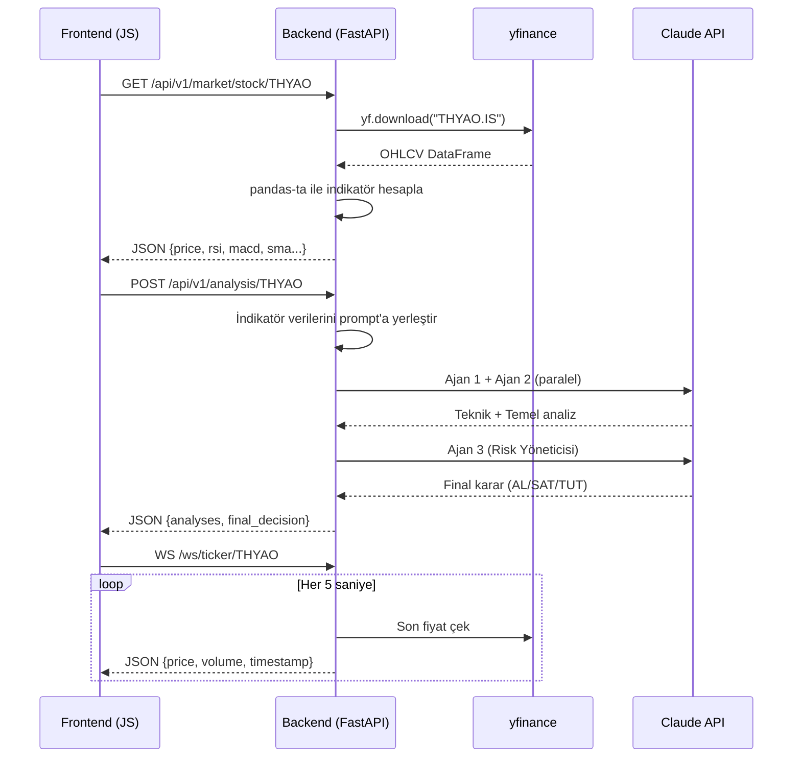

# BIST Finansal Analiz Motoru — Implementation Plan

## Proje Özeti

Borsa İstanbul (BIST) hisse senetlerini gerçek zamanlı çekerek, teknik indikatörleri hesaplayan ve **3 Ajanlı Yapay Zeka Prompt Mimarisi** ile Al/Sat/Tut kararları üreten bir web uygulaması. Backend tamamen Python (FastAPI), frontend vanilla HTML/CSS/JS.

---

## User Review Required

> [!IMPORTANT]
> **Yapı Kredi API Erişimi**: Yapı Kredi API (`api.yapikredi.com.tr`) OAuth2 tabanlı, kurumsal erişim gerektiren bir API'dir. Bireysel developer erişimi sınırlıdır. **Birincil veri kaynağı olarak `yfinance` (ücretsiz, `.IS` suffix ile BIST desteği)** kullanılması önerilir. Yapı Kredi API entegrasyonu opsiyonel modül olarak eklenecektir.

> [!WARNING]
> **Claude API Key Gerekli**: Backend'in çalışması için `ANTHROPIC_API_KEY` ortam değişkeni gereklidir. API maliyetleri kullanıma bağlıdır (Claude 3.5 Sonnet önerilir).

> [!IMPORTANT]
> **3. Ajan Detayı**: README dosyasında sadece Teknik Analiz Ajanı'nın prompt'u vardı. Plan, aşağıdaki 3 ajanı varsayıyor:
> 1. **Teknik Analiz Ajanı** — İndikatör yorumlama (RSI, MACD, SMA)
> 2. **Temel Analiz Ajanı** — F/K, PD/DD, piyasa değeri analizi
> 3. **Risk Yöneticisi Ajanı** — İki ajanın çıktılarını birleştirip final karar (Al/Sat/Tut)
>
> Bu yapı doğru mu? Farklı bir 3. ajan tanımı varsa lütfen belirtin.

---

## Open Questions

> [!IMPORTANT]
> 1. **Claude Model Tercihi**: `claude-sonnet-4-20250514` mi yoksa daha ekonomik bir model mi kullanılmalı?
> 2. **Yapı Kredi API Credentials**: OAuth2 `client_id` ve `client_secret` elinizde mi, yoksa sadece yfinance ile mi ilerleyelim?
> 3. **Frontend Grafik Kütüphanesi**: Chart.js mi, Lightweight Charts (TradingView) mı, yoksa ApexCharts mı tercih edilir?
> 4. **Deployment Ortamı**: Lokal geliştirme mi, Docker mı, bulut (Railway/Render) mı hedefleniyor?

---

## Teknoloji Kararları

| Katman | Teknoloji | Neden |
|:---|:---|:---|
| **Backend Framework** | FastAPI (ASGI) | Native async, WebSocket, Pydantic v2, auto-docs |
| **Veri Kaynağı (Birincil)** | yfinance (`THYAO.IS`) | Ücretsiz, güvenilir, BIST desteği |
| **Veri Kaynağı (Opsiyonel)** | Yapı Kredi API | Kurumsal, 15dk gecikmeli |
| **Teknik İndikatörler** | pandas-ta | Saf Python, Windows uyumlu, pip ile kurulum |
| **LLM Entegrasyonu** | anthropic SDK (AsyncAnthropic) | Async, structured outputs, streaming |
| **Frontend** | Vanilla HTML/CSS/JS | Hafif, bağımsız, basit deploy |
| **Grafik** | Lightweight Charts (TradingView) | Profesyonel finansal grafikler |

---

## Proposed Changes

### 📁 Proje Klasör Yapısı

```
bist-analiz-motoru/
├── backend/                          # Python FastAPI Backend
│   ├── app/
│   │   ├── __init__.py
│   │   ├── main.py                   # FastAPI app, CORS, router mounting
│   │   ├── config.py                 # Ortam değişkenleri, API keys, sabitler
│   │   ├── models/
│   │   │   ├── __init__.py
│   │   │   ├── schemas.py            # Pydantic request/response modelleri
│   │   │   └── enums.py              # Sinyal türleri, zaman dilimleri
│   │   ├── services/
│   │   │   ├── __init__.py
│   │   │   ├── data_fetcher.py       # yfinance + Yapı Kredi veri çekimi
│   │   │   ├── indicator_engine.py   # pandas-ta ile RSI, MACD, SMA hesaplama
│   │   │   └── ai_analyzer.py        # 3 Ajanlı Claude prompt mimarisi
│   │   ├── routers/
│   │   │   ├── __init__.py
│   │   │   ├── market.py             # /api/v1/market/* endpointleri
│   │   │   ├── analysis.py           # /api/v1/analysis/* endpointleri
│   │   │   └── websocket.py          # WebSocket stream endpointleri
│   │   └── prompts/
│   │       ├── technical_analyst.py   # Teknik Analiz Ajanı prompt şablonu
│   │       ├── fundamental_analyst.py # Temel Analiz Ajanı prompt şablonu
│   │       └── risk_manager.py        # Risk Yöneticisi Ajanı prompt şablonu
│   ├── requirements.txt
│   ├── .env.example                  # Örnek ortam değişkenleri
│   └── run.py                        # Uvicorn launcher script
│
├── frontend/                         # Vanilla HTML/CSS/JS Frontend
│   ├── index.html                    # Ana kullanıcı arayüzü
│   ├── assets/
│   │   ├── css/
│   │   │   └── style.css             # Ana stil dosyası (dark theme, glassmorphism)
│   │   └── js/
│   │       ├── config.js             # Backend API URL, sabitler
│   │       ├── api.js                # Backend'e fetch/WebSocket bağlantısı
│   │       ├── chart.js              # Lightweight Charts grafik çizimi
│   │       ├── ui.js                 # DOM manipülasyonu, sonuç gösterimi
│   │       └── app.js                # Ana başlatıcı, modül birleştirici
│   └── assets/
│       └── img/                      # Logo, ikonlar
│
├── gemini-code-1785169676909.md      # Orijinal proje spesifikasyonu
└── README.md                         # Proje dokümantasyonu
```

---

### Backend Bileşenleri

#### [NEW] [requirements.txt](file:///c:/Users/Huawei/Desktop/Yeni%20klasör/backend/requirements.txt)
Python bağımlılıkları:
```text
fastapi>=0.115.0
uvicorn[standard]>=0.30.0
pandas>=2.2.0
pandas-ta>=0.3.14b0
yfinance>=0.2.40
anthropic>=0.30.0
pydantic>=2.7.0
pydantic-settings>=2.3.0
httpx>=0.27.0
python-dotenv>=1.0.0
```

---

#### [NEW] [main.py](file:///c:/Users/Huawei/Desktop/Yeni%20klasör/backend/app/main.py)
- FastAPI uygulaması oluşturma
- CORS middleware (frontend `http://localhost:5500` ve `http://127.0.0.1:5500`)
- Router mounting (`/api/v1/market`, `/api/v1/analysis`)
- Startup event'te bağlantı kontrolü

#### [NEW] [config.py](file:///c:/Users/Huawei/Desktop/Yeni%20klasör/backend/app/config.py)
- `pydantic-settings` ile ortam değişkenleri yönetimi
- `ANTHROPIC_API_KEY`, `YAPIKREDI_CLIENT_ID`, `YAPIKREDI_CLIENT_SECRET`
- Default değerler ve doğrulama

---

#### [NEW] [schemas.py](file:///c:/Users/Huawei/Desktop/Yeni%20klasör/backend/app/models/schemas.py)
Pydantic modelleri:
```python
class StockIndicators(BaseModel):
    symbol: str
    last_price: float
    sma_20: float | None
    sma_50: float | None
    sma_200: float | None
    rsi_14: float | None
    macd: float | None
    macd_signal: float | None
    macd_hist: float | None
    timestamp: str

class AgentAnalysis(BaseModel):
    agent_name: str          # "teknik_analist" | "temel_analist" | "risk_yoneticisi"
    analysis_text: str       # Ajanın detaylı analiz metni
    signal: str              # "AL" | "SAT" | "TUT"
    confidence: float        # 0.0 - 1.0
    key_levels: dict | None  # Destek/direnç seviyeleri

class FullAnalysisResponse(BaseModel):
    symbol: str
    timestamp: str
    indicators: StockIndicators
    technical_analysis: AgentAnalysis
    fundamental_analysis: AgentAnalysis
    risk_assessment: AgentAnalysis
    final_decision: str      # "AL" | "SAT" | "TUT"
    final_confidence: float
    summary: str             # Türkçe özet
```

---

#### [NEW] [data_fetcher.py](file:///c:/Users/Huawei/Desktop/Yeni%20klasör/backend/app/services/data_fetcher.py)
- `fetch_stock_data(symbol, period, interval)` — yfinance üzerinden OHLCV çekme
- `fetch_yapikredi_data(symbol)` — Opsiyonel Yapı Kredi API entegrasyonu
- `fetch_bist_indices()` — XU100, XU030 endeks verileri
- Hata yönetimi ve retry mantığı

#### [NEW] [indicator_engine.py](file:///c:/Users/Huawei/Desktop/Yeni%20klasör/backend/app/services/indicator_engine.py)
- `calculate_all_indicators(df)` — Tek fonksiyonla tüm indikatörleri hesapla:
  - SMA(20), SMA(50), SMA(200)
  - RSI(14)
  - MACD(12, 26, 9)
  - Bollinger Bands(20, 2)
  - ATR(14)
  - Destek/Direnç seviyeleri (pivot noktaları)

#### [NEW] [ai_analyzer.py](file:///c:/Users/Huawei/Desktop/Yeni%20klasör/backend/app/services/ai_analyzer.py)
**3 Ajanlı Prompt Mimarisi:**

```
┌─────────────────────────────────────────────────┐
│          Ham Fiyat/Hacim Verisi (OHLCV)         │
│              (yfinance / Yapı Kredi)            │
└────────────────────┬────────────────────────────┘
                     │
                     ▼
        ┌────────────────────────┐
        │   İndikatör Hesaplama  │
        │     (pandas-ta)        │
        └────────────┬───────────┘
                     │
          ┌──────────┼──────────┐
          ▼          ▼          ▼
   ┌──────────┐ ┌──────────┐ ┌──────────┐
   │ Ajan #1  │ │ Ajan #2  │ │          │
   │ Teknik   │ │ Temel    │ │          │
   │ Analist  │ │ Analist  │ │          │
   └────┬─────┘ └────┬─────┘ │          │
        │             │       │          │
        └──────┬──────┘       │          │
               ▼              │          │
        ┌──────────┐          │          │
        │ Ajan #3  │◄─────────┘          │
        │ Risk     │    Ajan 1+2 çıktıları│
        │ Yöneticisi│   birleştirilerek   │
        └────┬─────┘   gönderilir        │
             │                            │
             ▼                            │
     ┌───────────────┐                    │
     │ Final Karar   │                    │
     │ AL / SAT / TUT│                    │
     │ + Güven Skoru │                    │
     └───────────────┘                    │
```

- Ajan 1 ve 2 **paralel** olarak Claude'a gönderilir (`asyncio.gather`)
- Ajan 3 (Risk Yöneticisi) diğer ikisinin çıktılarını alıp **final kararı** verir
- Her ajan kendi prompt template'ini kullanır (`prompts/` klasörü)

---

#### [NEW] [market.py](file:///c:/Users/Huawei/Desktop/Yeni%20klasör/backend/app/routers/market.py) — Market Data Router
| Endpoint | Method | Açıklama |
|:---|:---|:---|
| `/api/v1/market/stock/{symbol}` | GET | Hisse OHLCV + indikatör verisi |
| `/api/v1/market/indices` | GET | BIST endeksleri (XU100, XU030) |
| `/api/v1/market/history/{symbol}` | GET | Geçmiş fiyat serisi (grafik için) |

#### [NEW] [analysis.py](file:///c:/Users/Huawei/Desktop/Yeni%20klasör/backend/app/routers/analysis.py) — AI Analysis Router
| Endpoint | Method | Açıklama |
|:---|:---|:---|
| `/api/v1/analysis/{symbol}` | POST | 3 Ajanlı tam AI analizi başlat |
| `/api/v1/analysis/{symbol}/quick` | GET | Sadece teknik sinyal (hızlı) |

#### [NEW] [websocket.py](file:///c:/Users/Huawei/Desktop/Yeni%20klasör/backend/app/routers/websocket.py) — WebSocket Router
| Endpoint | Protocol | Açıklama |
|:---|:---|:---|
| `/ws/ticker/{symbol}` | WS | Canlı fiyat stream'i |

---

### Frontend Bileşenleri

#### [NEW] [index.html](file:///c:/Users/Huawei/Desktop/Yeni%20klasör/frontend/index.html)
- Dark theme, glassmorphism UI
- Hisse arama kutusu
- Gerçek zamanlı fiyat kartı
- TradingView Lightweight Charts grafik alanı
- AI analiz sonuç paneli (3 ajanın çıktıları)
- Final karar göstergesi (AL/SAT/TUT badge)

#### [NEW] [style.css](file:///c:/Users/Huawei/Desktop/Yeni%20klasör/frontend/assets/css/style.css)
- CSS Custom Properties (design tokens)
- Dark mode varsayılan
- Glassmorphism kartlar
- Gradient aksan renkleri
- Responsive grid layout
- Animasyonlar (fade-in, pulse, shimmer loading)

#### [NEW] [config.js](file:///c:/Users/Huawei/Desktop/Yeni%20klasör/frontend/assets/js/config.js)
- `API_BASE_URL = 'http://localhost:8000/api/v1'`
- `WS_BASE_URL = 'ws://localhost:8000/ws'`
- Popüler BIST hisseleri listesi

#### [NEW] [api.js](file:///c:/Users/Huawei/Desktop/Yeni%20klasör/frontend/assets/js/api.js)
- `fetchStockData(symbol)` → `GET /market/stock/{symbol}`
- `requestAnalysis(symbol)` → `POST /analysis/{symbol}`
- `connectWebSocket(symbol, onMessage)` → `ws://localhost:8000/ws/ticker/{symbol}`

#### [NEW] [chart.js](file:///c:/Users/Huawei/Desktop/Yeni%20klasör/frontend/assets/js/chart.js)
- TradingView Lightweight Charts ile mum grafik çizimi
- SMA çizgileri overlay
- Hacim bar chart
- Responsive resize

#### [NEW] [ui.js](file:///c:/Users/Huawei/Desktop/Yeni%20klasör/frontend/assets/js/ui.js)
- İndikatör kartlarını güncelleme
- AI analiz sonuçlarını render etme
- Loading/error state yönetimi
- Sinyal badge animasyonları

#### [NEW] [app.js](file:///c:/Users/Huawei/Desktop/Yeni%20klasör/frontend/assets/js/app.js)
- Tüm modülleri başlatma
- Event listener'lar (arama, buton tıklama)
- WebSocket bağlantı yönetimi

---

## Frontend-Backend Haberleşme Mimarisi



---

## Verification Plan

### Automated Tests
```bash
# Backend'i başlat
cd backend && uvicorn app.main:app --reload --port 8000

# Endpoint testleri
curl http://localhost:8000/api/v1/market/stock/THYAO
curl -X POST http://localhost:8000/api/v1/analysis/THYAO

# API docs kontrolü
# Tarayıcıda: http://localhost:8000/docs
```

### Manual Verification
1. Frontend'i Live Server ile aç (`http://localhost:5500`)
2. Hisse ara (THYAO, GARAN, AKBNK)
3. İndikatör kartlarının dolduğunu kontrol et
4. AI analiz butonuna bas, 3 ajanın çıktılarını görüntüle
5. WebSocket ile canlı fiyat akışını gözlemle
6. Responsive tasarımı mobilde test et
